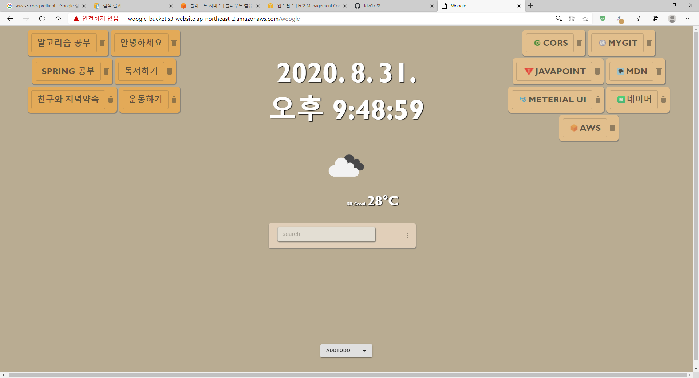

# ToDoList(WoogleWoogle)
## 내용
reactJS와 SpringMVC을 이용한 간단한 웹애플리케이션
http://woogle-bucket.s3-website.ap-northeast-2.amazonaws.com/

## 기술
 * frontend = ReactJS 16.14.1 / material-ui / Axios
 * webServer = AWS S3
 * backend = spring 4.3.7 ( MVC, lombok, JPA) / Tomcat 8.5 / MySql 8.0
 * react 의 Axios를 이용하여 backend와 통신하여 데이터를 주고 받는다.
 * JS geolocation으로 사용자의 현재위치를 불러와 현재위치의 날씨를 가져온다 
 * woogle contents의 내용들은 DB에 저장 
 * Restful API 이용하여 자원처리 @GetMapping("/woogle") @PostMapping("/woogle") @DeleteMapping("/woogle")
## 기능
 * 실시간 시간확인
 * 사용자의 현재위치를 기반으로 weatherAPI의 데이터를 이용하여 날씨 표현
 * 개인적으로 자주 사용되는 사이트 검색기능
 * 페이지 좌우를 나누어 toDoList와 자주방문하는 URL 표현
 * list목록은 등록, 삭제가 자유롭게 가능.
 * toDoList 버튼 클릭 시, 마우스커서 위치에 detail화면을 띄어준다.
 * URL 버튼을 클릭 시 해당 사이트로 이동.
 * 창 크기에 최대한 제약이 없도록 컴포넌트를 배치(반응형)     
## Issue
 * Geolocation API의 위치관련 정보는 인증서가 적용된 https 웹에서 적용가능.
## 구동
</img>

</img>

</img>

</img>

</img>

